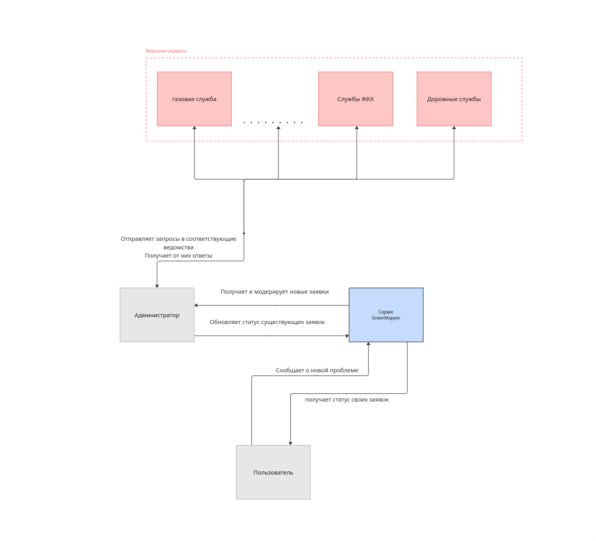
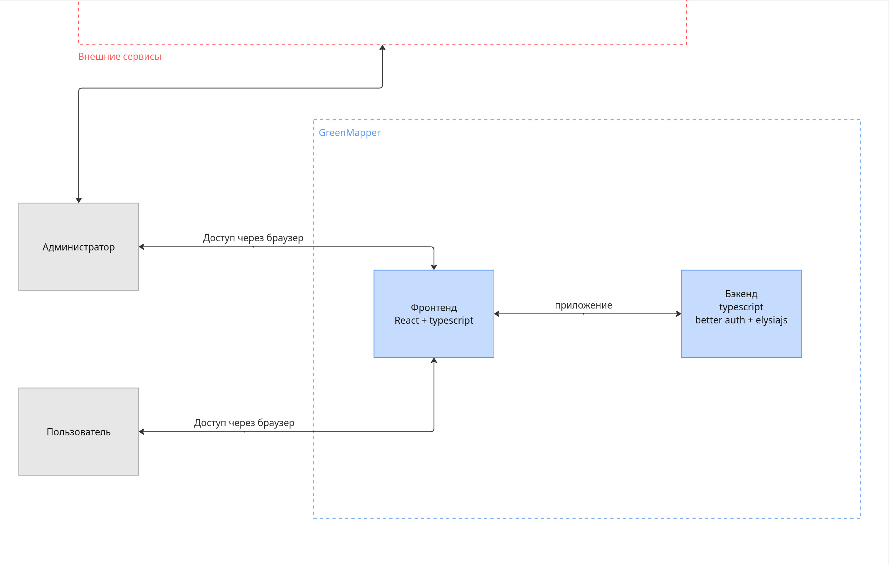
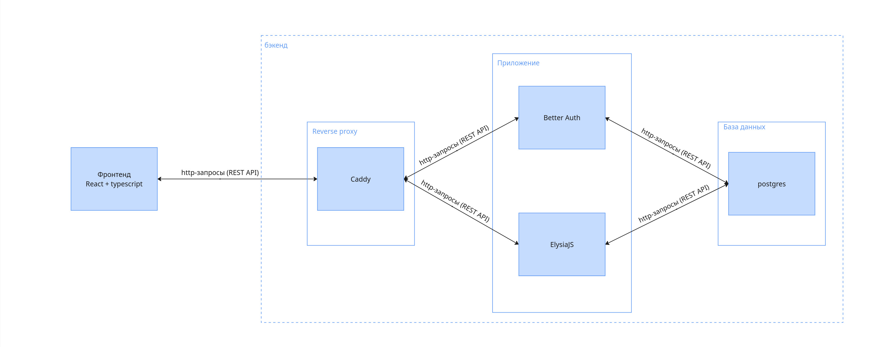
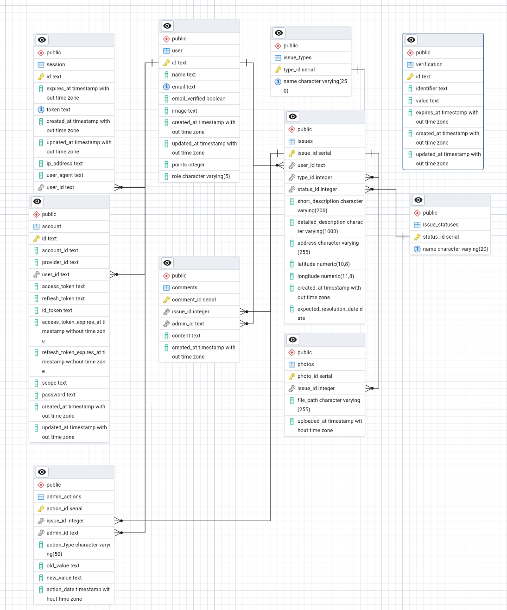

# GreenMapper

### Сервис сбора и отображения городских проблем на карте с системой заявок, типами проблем и статусами их решения, а также аутентификацией и ролями пользователей

> Фронтенд: <br/>
  React + Vite + OpenLayers <br/>
>
> Бэкенд: <br/>
  Bun + Elysia + PostgreSQL + Drizzle ORM <br/>
>
> Аутентификация: <br/>
  Better Auth

## Участники
| ФИО | Группа |
|-----|--------|
| Терещенков Николай Юрьевич | 5130904/30101 |
| Пузанов Егор Алексеевич	| 5130904/30101 | 
| Полубояринов Илья Вадимович	| 5130904/30101 |
| Яковлев Глеб Павлович	| 5130904/30101 |


## Определение проблемы
Горожанам сложно сообщать о локальных проблемах (разбитые дороги, разбросанный мусор, неработающие фонари) и оперативно отслеживать ход их решения. Инструменты городских служб либо недоступны, либо неудобны. Отсутствует единая точка для подачи заявки на карте с понятной категоризацией и прозрачным статусом выполнения.

## Выработка требований

### Пользовательские истории
1. Как пользователь, я хочу авторизоваться и создавать заявку на карте с указанием адреса, координат и типа проблемы, чтобы фиксировать проблему в системе.
2. Как пользователь, я хочу видеть все заявки на карте с кратким описанием, именем автора, типом и статусом, чтобы понимать обстановку в районе.
3. Как пользователь, я хочу видеть список доступных типов заявок и фильтровать по ним, чтобы находить подходящие проблемы.
4. Как администратор, я хочу менять статус заявки (например, «в обработке», «в работе», «выполнено») и при необходимости удалять некорректные заявки, чтобы поддерживать актуальность данных.
5. Как пользователь, я хочу видеть свой профиль и количество баллов за активность, чтобы понимать вклад в сообщество.

## Разработĸа архитеĸтуры и детальное проеĸтирование

### Оценка масштаба 
10 000 активных пользователей/сутки; период хранения данных: > 5 лет.

#### Характер нагрузки
- Соотношение R/W: запись превышает чтение, т.к. ~95% пользователей - горожане, основной сценарий - это подача заявок. <br/>
Будем считать: **60% запись / 40% чтение** (С учётом подгрузки всех заявок при заходе в приложении и кешировании данного процесса).
- Трафик 
  - Запросы в день (без фото, оценка): при 10 000 пользователей допустим  ~11 000-12 000 запросов/день.
  - RPS: `12 000 / (24×60×60) = 0,139 rps`
  - RPM:  `= 8,3 rpm`
  - Трафик (JSON, без фото):
    - Запросы на запись (тела/ответы ~0,8-1,2 КБ): при ~6 900/день = 8-9 МБ/день;
    - Запросы на чтение (~30 КБ на ответ): ~4 600/день = 138 МБ/день;
    - Итого: ~ `147 МБ/день`
- Диски (метаданные без фото): одна запись заявки ~1-2 КБ. При при ~6 900 заявок/день = `8-9 МБ/день`. Хранение фото предусмотрено в БД.

После реализации подгрузки фото для заявки, трафик и использование диска увеличатся:
- При среднем размере фото 2 МБ и доле 30% заявок с фото: `6 900 * 0,3 * 2 МБ = 4,14 ГБ/день` дополнительного сетевого трафика (к JSON‑трафику выше).
Итого для трафика будет ~ `4,28 ГБ/день` 
- Хранение: +4,14 ГБ/день; за 5 лет (~1 825 дней) - около `7,6 ТБ` без учёта очистки/сжатия.

### Диаграммы C4 Model
Контекст:



Контейнеры:



Компоненты:



### Контракты API
Краткая спецификация приведена в разделе «API (детально)» ниже.

### Схема БД и нефункциональные требования
Основные таблицы: `user`, `issues`, `issue_types`, `issue_statuses`, дополнительные: `photos`, `comments`, `admin_actions`.

Отношения заданы через Drizzle `relations(...)`. Миграции - в `backend/drizzle/`.

ERD схема:




Нефункциональным требования:

### Производительность

- Нормализация таблиц (user, session, account) уменьшает дублирование и ускоряет запросы за счёт кэширования планов в Postgres.
- Целочисленные ключи для основных таблиц и текстовые для auth-таблиц минимизируют затраты на джоины, уменьшая размер индексов и повышая селективность.

### Целостность данных

- Метаданные в Postgres обеспечивают строгую транзакционную согласованность через внешние ключи (FK) и каскадное удаление, исключая «висячие» записи.
- FK на user.id в основных таблицах гарантируют целостность без дополнительных проверок.

### Безопасность

- Хранение данных аутентификации в Postgres упрощает аудит, отзыв токенов и ротацию сессий, соответствуя требованиям Better Auth.
- Postgres поддерживает RLS/ACL и аудит доступа, обеспечивая минимальные привилегии.

### Сопровождение

- Схема совместима с Drizzle и Better Auth, упрощая миграции и типобезопасные запросы. 
- Индексы и структура схемы облегчают диагностику (EXPLAIN) и обслуживание (VACUUM/REINDEX). 

Идентификаторы: `issues.issueId` (serial), пользователи - внешнеуправляемые `user.id` (text, Better Auth). Для долгосрочного хранения >5 лет - миграции (Drizzle) и возможность шардирования при росте объёма.

### Схема масштабирования x10
- Горизонтальное масштабирование бэкенда за балансировщиком (stateless, сессии - cookie + Better Auth). 
- БД: увеличение размеров пула соединений, реплика для чтения, добавить секционирование, индексы по `statusId`, `typeId`, `(latitude, longitude)` при потребности в геопоиске (геоиндексы - план на расширение сервиса).
- Кэширование частых выборок `/reports/`


## Unit-тестирование
Для запуска unit-тестов (frontend + backend) используется Docker и bash, на хосте достаточно установленного Docker.

- **Backend unit-тесты**: `bun test` в директории `backend/test`: проверяются роуты и вспомогательная логика без реальной БД.
- **Frontend unit-тесты**: `vitest` в директории `frontend/src/test`: тестируются хуки, утилиты и клиентские функции.

Оба набора тестов запускаются автоматически через общий скрипт (см. раздел «Сборка и запуск»).

## Интеграционное тестирование
Интеграционные тесты находятся в `backend/tests` и покрывают полный сценарий:

- **Регистрация/логин** пользователя через Better Auth
- **Создание заявки** через HTTP API `/reports`
- **Проверка сохранения заявки** в PostgreSQL через Drizzle ORM


## Сборка и запуск
В проекте есть bash-скрипт `run_all.sh`, который выполняет полный цикл «сборка -> unit-тесты -> интеграционные тесты -> запуск приложения» в одной команде.

1. **Сборка**:
   - Собирается Docker-образ backend `greenmapper-backend` (Bun + Elysia).
   - Собирается Docker-образ frontend `greenmapper-frontend` (Bun + Vite + Caddy).
2. **Unit-тесты**:
   - В контейнере `oven/bun` выполняются backend-тесты из `backend/test`.
   - Во втором контейнере `oven/bun` выполняются frontend-тесты `vitest` из `frontend/src/test`.
3. **Интеграционные тесты**:
   - В отдельной Docker-сети поднимаются контейнеры PostgreSQL и backend.
   - При старте backend вызывает `dist/migrate.js`, который применяет миграции Drizzle и **добавляет базовые 1 тип проблемы и 1 статус заявки** в таблицах `issue_types` и `issue_statuses`.
   - В отдельном контейнере запускаются тесты из `backend/tests`, которые обращаются к живому HTTP API и БД.
4. **Запуск приложения**:
   - В Docker-сети `greenmapper-app-net` поднимаются PostgreSQL и backend с пробросом портов:
     - Backend: `http://localhost:3000`
     - PostgreSQL: `localhost:5252` (для локальных подключений, если требуется).
   - Поднимается frontend (Caddy) на `http://localhost:5173`.

### Итого

- **Требования**: установлен `docker` и `bash`
- **Команда** (из корня репозитория):

```bash
./run_all.sh
```

После успешного выполнения:

- Backend будет доступен по адресу: `http://localhost:3000`
- Frontend будет доступен по адресу: `http://localhost:5173`

## API (детально)

Бэкенд: `http://localhost:3000`. CORS разрешает `http://localhost:5173`.

## Authentication (better-auth)

### POST /auth/sign-up
**Описание**: Регистрация нового пользователя

**Входные данные (body)**:
```json
{
  "email": "ivan@example.com",
  "password": "Str0ngP@ssw0rd",
  "name": "Иван"
}
```

**Выходные данные (201)**:
```json
{
  "user": {
    "id": "user_123",
    "email": "ivan@example.com",
    "name": "Иван",
    "createdAt": "2025-11-01T12:00:00Z"
  }
}
```

**Возможные коды ответов**:
- `201` — Пользователь создан
- `400` — Некорректные данные (email уже существует, пароль слабый)
- `500` — Внутренняя ошибка сервера

---

### POST /auth/sign-in
**Описание**: Вход пользователя в систему

**Входные данные (body)**:
```json
{
  "email": "ivan@example.com",
  "password": "Str0ngP@ssw0rd"
}
```

**Выходные данные (200)**:
```json
{
  "session": {
    "token": "<SESSION_TOKEN>",
    "expiresAt": "2025-12-17T12:00:00Z"
  },
  "user": {
    "id": "user_123",
    "email": "ivan@example.com",
    "name": "Иван"
  }
}
```

**Возможные коды ответов**:
- `200` — Успешный вход
- `400` — Некорректный email или пароль
- `401` — Неверные учетные данные
- `500` — Внутренняя ошибка сервера

---

### POST /auth/sign-out
**Описание**: Выход пользователя из системы

**Входные данные**: нет (требуется Auth header)

**Выходные данные (200)**:
```json
{ "success": true }
```

**Возможные коды ответов**:
- `200` — Успешный выход
- `401` — Неавторизован
- `500` — Внутренняя ошибка сервера

---

### GET /auth/session
**Описание**: Получить текущую сессию пользователя

**Входные данные**: нет

**Выходные данные (200)**:
```json
{
  "session": {
    "id": "session_123",
    "userId": "user_123",
    "expiresAt": "2025-12-17T12:00:00Z"
  },
  "user": {
    "id": "user_123",
    "email": "ivan@example.com",
    "name": "Иван",
    "points": 5,
    "role": "user"
  }
}
```

**Возможные коды ответов**:
- `200` — Сессия активна
- `401` — Нет активной сессии
- `500` — Внутренняя ошибка сервера

---

## Users

### GET /users/me
**Описание**: Получить информацию о текущем авторизованном пользователе

**Требуется Auth**: Да

**Входные данные**: нет

**Выходные данные (200)**:
```json
{
  "id": "user_123",
  "name": "Иван",
  "email": "ivan@example.com",
  "emailVerified": true,
  "image": null,
  "createdAt": "2025-11-01T12:00:00Z",
  "updatedAt": "2025-11-02T12:00:00Z",
  "points": 5,
  "role": "user"
}
```

**Возможные коды ответов**:
- `200` — Успешно получено
- `401` — Неавторизован
- `404` — Пользователь не найден
- `500` — Внутренняя ошибка сервера

---

## Reports (Заявки)

### GET /reports
**Описание**: Получить список всех заявок с информацией о типе, статусе и авторе

**Требуется Auth**: Да

**Входные данные**: нет (опционально query параметры для фильтрации)

**Выходные данные (200)**:
```json
[
  {
    "issueId": 12,
    "shortDescription": "Разбитый тротуар",
    "detailedDescription": "Дыра около дома 5",
    "address": "ул. Примерная, 5",
    "latitude": "55.755825",
    "longitude": "37.617298",
    "createdAt": "2025-11-10T10:00:00Z",
    "expectedResolutionDate": null,
    "statusName": "В обработке",
    "statusId": 1,
    "typeName": "Инфраструктура",
    "userName": "Иван",
    "userPoints": 10
  }
]
```

**Возможные коды ответов**:
- `200` — Список получен
- `401` — Неавторизован
- `500` — Внутренняя ошибка сервера

---

### GET /reports/:id
**Описание**: Получить одну конкретную заявку по ID

**Требуется Auth**: Да

**Входные данные**:
- `id` (path parameter, number) — ID заявки

**Выходные данные (200)**:
```json
{
  "issueId": 12,
  "userId": "user_123",
  "typeId": 1,
  "statusId": 1,
  "shortDescription": "Разбитый тротуар",
  "detailedDescription": "Дыра около дома 5",
  "address": "ул. Примерная, 5",
  "latitude": "55.755825",
  "longitude": "37.617298",
  "createdAt": "2025-11-10T10:00:00Z",
  "expectedResolutionDate": null
}
```

**Возможные коды ответов**:
- `200` — Заявка получена
- `401` — Неавторизован
- `404` — Заявка не найдена
- `500` — Внутренняя ошибка сервера

---

### GET /reports/issue-types
**Описание**: Получить список доступных типов заявок

**Требуется Auth**: Да

**Входные данные**: нет

**Выходные данные (200)**:
```json
[
  { "typeId": 1, "name": "Инфраструктура" },
  { "typeId": 2, "name": "Экология" },
  { "typeId": 3, "name": "Дорожная" }
]
```

**Возможные коды ответов**:
- `200` — Список типов получен
- `401` — Неавторизован
- `500` — Внутренняя ошибка сервера

---

### POST /reports
**Описание**: Создать новую заявку

**Требуется Auth**: Да

**Входные данные (body)**:
```json
{
  "latitude": "55.755825",
  "longitude": "37.617298",
  "typeId": 2,
  "shortDescription": "Колодец открыт",
  "detailedDescription": "Рядом со школой",
  "address": "ул. Примерная, 10"
}
```

**Валидация**:
- `latitude` (string) — обязательно
- `longitude` (string) — обязательно
- `typeId` (number) — обязательно, должен существовать в `issue_types`
- `shortDescription` (string) — обязательно, макс 200 символов
- `detailedDescription` (string) — опционально, макс 1000 символов
- `address` (string) — обязательно, макс 255 символов

**Выходные данные (201)**:
```json
{
  "issueId": 101,
  "userId": "user_123",
  "typeId": 2,
  "statusId": 1,
  "shortDescription": "Колодец открыт",
  "detailedDescription": "Рядом со школой",
  "address": "ул. Примерная, 10",
  "latitude": "55.755825",
  "longitude": "37.617298",
  "createdAt": "2025-11-16T12:00:00Z",
  "expectedResolutionDate": null
}
```

**Возможные коды ответов**:
- `201` — Заявка создана успешно
- `400` — Некорректные входные данные (typeId не найден, некорректное тело)
- `401` — Неавторизован
- `500` — Внутренняя ошибка сервера

---

### DELETE /reports/:id
**Описание**: Удалить заявку (только для администраторов)

**Требуется Auth**: Да (роль `admin`)

**Входные данные**:
- `id` (path parameter, number) — ID заявки

**Выходные данные (200)**:
```json
{
  "success": true,
  "issueId": 101
}
```

**Возможные коды ответов**:
- `200` — Заявка удалена
- `401` — Неавторизован
- `403` — Недостаточно прав (не администратор)
- `404` — Заявка не найдена
- `500` — Внутренняя ошибка сервера

---

### PUT /reports/:id/status
**Описание**: Изменить статус заявки (только для администраторов)

**Требуется Auth**: Да (роль `admin`)

**Входные данные**:
- `id` (path parameter, number) — ID заявки
- Body:
```json
{
  "statusId": 2
}
```

**Валидация**:
- `statusId` (number) — обязательно, должен существовать в `issue_statuses`

**Выходные данные (200)**:
```json
{
  "success": true,
  "issue": {
    "issueId": 101,
    "statusId": 2
  }
}
```

**Возможные коды ответов**:
- `200` — Статус обновлен
- `400` — Некорректные входные данные
- `401` — Неавторизован
- `403` — Недостаточно прав (не администратор)
- `404` — Заявка не найдена
- `500` — Внутренняя ошибка сервера

---

## Таблицы и схемы

### Пользователи (user)
```json
{
  "id": "string (primary key)",
  "name": "string",
  "email": "string (unique)",
  "emailVerified": "boolean",
  "image": "string | null",
  "createdAt": "timestamp",
  "updatedAt": "timestamp",
  "points": "integer (default: 0)",
  "role": "user | admin (default: user)"
}
```

### Заявки (issues)
```json
{
  "issueId": "integer (primary key)",
  "userId": "string (foreign key -> user.id)",
  "typeId": "integer (foreign key -> issue_types.typeId)",
  "statusId": "integer (foreign key -> issue_statuses.statusId)",
  "shortDescription": "string (max 200)",
  "detailedDescription": "string (max 1000) | null",
  "address": "string (max 255)",
  "latitude": "decimal",
  "longitude": "decimal",
  "createdAt": "timestamp (default: now)",
  "expectedResolutionDate": "date | null"
}
```

### Типы заявок (issue_types)
```json
{
  "typeId": "integer (primary key)",
  "name": "string (unique, max 250)"
}
```

### Статусы заявок (issue_statuses)
```json
{
  "statusId": "integer (primary key)",
  "name": "string (unique, max 20)"
}
```